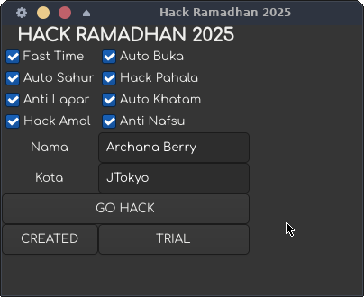

Berikut adalah **README.md** yang lebih interaktif dan asyik untuk proyek **Hack Ramadhan 2025**.  

---

## **hackramadhan2025**  
> Aplikasi mencurangi puasa (sebagai hiburan semata) untuk Indonesia dan sekitarnya UwU~  



**Hack Ramadhan 2025** adalah aplikasi bercandaan yang seolah-olah bisa "meng-hack" jalannya puasa, mulai dari **Fast Time**, **Auto Buka**, **Hack Pahala**, hingga **Anti Lapar**. Tentunya ini hanya untuk hiburan semata, karena sejatinya puasa tidak bisa di-cheat!  

**Dibangun dengan:**  
- **Bahasa C** (biar lebih cepat dan ringan)  
- **GTK4** (biar tampilannya gak jadul kayak DOS)  

---

## **✨ Fitur-Fitur Kocak**  
✅ **Fast Time** – Waktu terasa lebih cepat  
✅ **Auto Buka** – Langsung bisa buka tanpa nunggu adzan  
✅ **Auto Sahur** – Auto makan sahur tanpa bangun  
✅ **Hack Pahala** – Dapat pahala tanpa ibadah  
✅ **Anti Lapar** – Gak bakal lapar selama puasa    
✅ **Auto Khatam** – Sekali klik langsung khatam Al-Qur’an  
✅ **Hack Amal** – Auto jadi orang dermawan tanpa nyumbang  
✅ **Anti Nafsu** – Gak akan tergoda makanan, minuman, gairah atau... yang lainnya  

---

## **🔧 Cara Kompilasi di Berbagai Distro Linux**  
Agar bisa menjalankan program ini, kamu harus menginstal **GTK4** terlebih dahulu.  

### **💻 Untuk Arch Linux dan Manjaro**  
```sh
sudo pacman -S gtk4 xorgproto xorg-xproto xorg-xrandr
./compile.sh
./hack_ramadhan
```

### **🐧 Untuk Ubuntu dan Debian**  
```sh
sudo apt update && sudo apt install -y libgtk-4-dev
./compile.sh
./hack_ramadhan
```

### **🚀 Untuk Fedora dan Red Hat (RHEL, CentOS, Rocky Linux, AlmaLinux)**  
```sh
sudo dnf install gtk4-devel
./compile.sh
./hack_ramadhan
```

### **🍏 Untuk openSUSE**  
```sh
sudo zypper install gtk4-devel
./compile.sh
./hack_ramadhan
```

### **📦 Jika Ingin Kompilasi Manual (Tanpa `compile.sh`)**  
```sh
gcc -o hack_ramadhan hack_ramadhan.c `pkg-config --cflags --libs gtk4`
./hack_ramadhan
```

---

## **🎉 Cara Menjalankan**  
Setelah kompilasi berhasil, jalankan aplikasi dengan:  
```sh
./hack_ramadhan
```
Lalu silakan pilih fitur **"cheat"** yang kamu inginkan dan tekan tombol **"GO HACK"**. Tapi ingat ya, **ini cuma buat bercanda!** Puasa tetap harus dilakukan dengan niat dan keikhlasan~  
